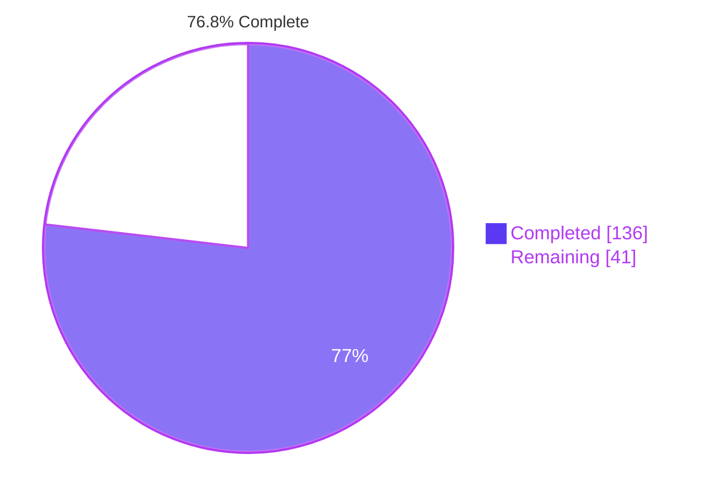
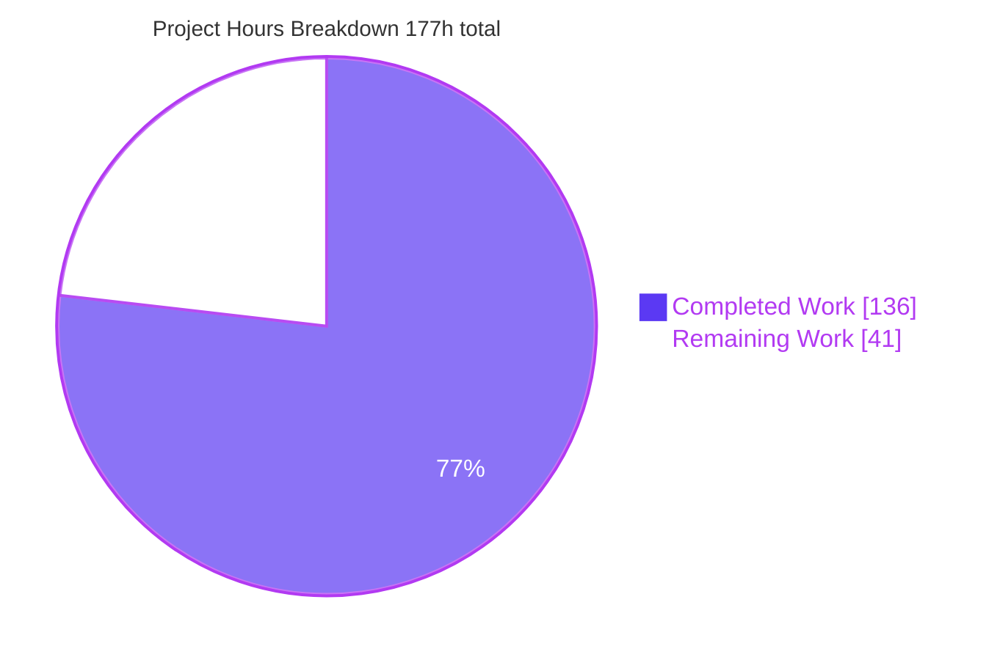
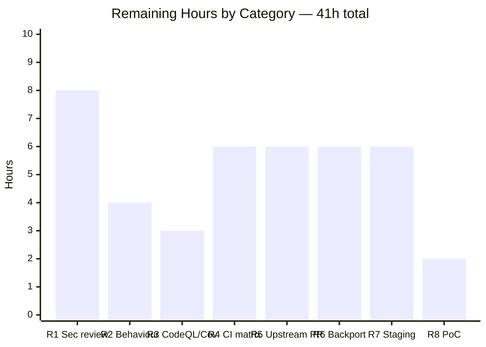
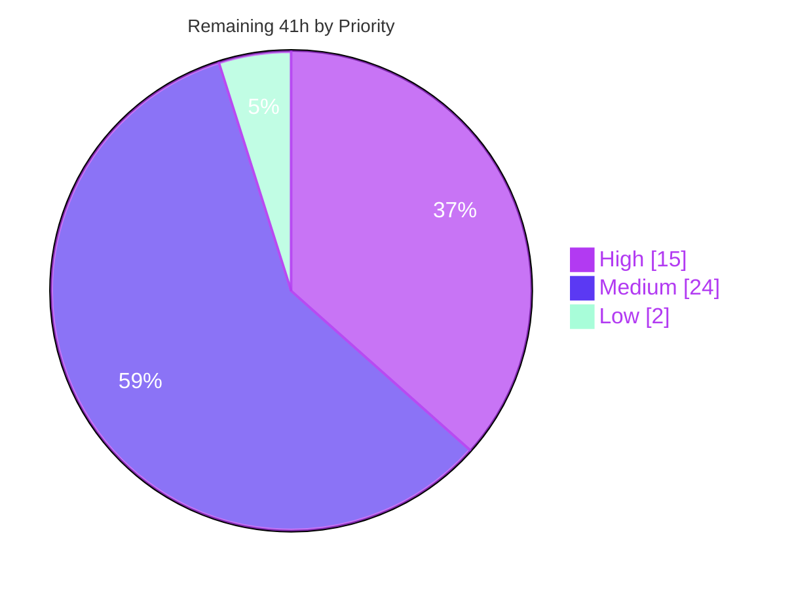
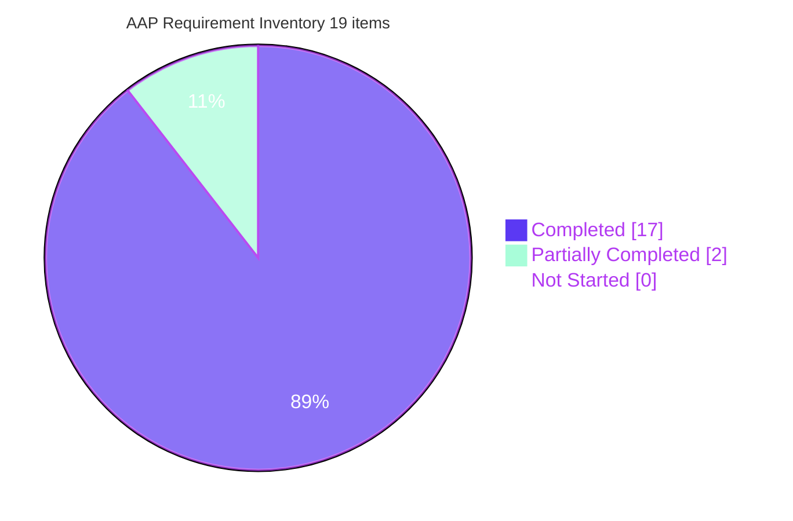

# Blitzy Project Guide — Squid Digest Authentication Parser Hardening

**Repository:** Squid Web Proxy Cache · **Version:** 8.0.0-VCS · **Branch:** `blitzy-24cdd117-3eda-4a5b-9d43-31ce888a19cd` · **Baseline:** `6f4c814b8` · **HEAD:** `738ddbe45`
**Change type:** Security remediation (single vulnerability class) · **Change scope:** MINIMAL — 1 production source file + 4 test artifacts

---

## 1. Executive Summary

### 1.1 Project Overview

This project hardens the HTTP Digest authentication credential parser in Squid Web Proxy Cache 8.0.0-VCS against a pre-authentication out-of-bounds heap write. `Auth::Digest::Config::decode()` previously copied attacker-controlled header fields into their destinations *before* validating length, with only one of nine extractions bounded. The remediation adds a declarative per-field capacity table, one shared bounded-extraction predicate, and validate-before-copy semantics for all nine fields, routing over-length input through the parser's existing clean-rejection path (HTTP 407 forward-proxy / 401 accelerator). Beneficiaries are every operator running `auth_param digest` on a public-facing forward-proxy or reverse-proxy port. Scope was deliberately minimal: one production file, plus the tree's first Digest regression coverage since 2011.

### 1.2 Completion Status



<div align="center"><b>76.8% COMPLETE</b> &nbsp;·&nbsp; <span style="color:#5B39F3">&#9632;</span> Completed (Dark Blue #5B39F3) &nbsp;·&nbsp; <span style="color:#FFFFFF">&#9633;</span> Remaining (White #FFFFFF)</div>

| Metric | Value |
|--------|-------|
| **Total Hours** | **177** |
| **Completed Hours (AI + Manual)** | **136** (AI 136 + Manual 0) |
| **Remaining Hours** | **41** |
| **Percent Complete** | **76.8%** |

**Calculation (PA1, AAP-scoped work only):** `136 ÷ 177 × 100 = 76.8362% → 76.8%`
**Work universe:** 19 AAP deliverables/verification obligations (136h, all delivered) + 8 path-to-production items (41h, human- or CI-gated). Nothing outside AAP scope or the path to production is counted.

### 1.3 Key Accomplishments

- [x] **The AAP Target State is met in full** — *"Every Digest field extraction is length-checked against destination capacity; inputs exceeding bounds are rejected before any copy occurs."* All **nine** field extractions in `Auth::Digest::Config::decode()` now validate before copying; previously **one of nine** was bounded.
- [x] **Declarative capacity contract** — `constexpr DigestFieldCapacities[]` (10 rows, each carrying a researched rationale with `file:line` evidence) keyed by `http_digest_attr_type`, enforced by `DigestFieldCapacitiesAreWellFormed()` + `static_assert`. Shipped contract matches the AAP table exactly: username ≤1024, realm ≤1024, qop ≤8, algorithm ≤8, uri = `String::RawSizeMaxXXX()` (65,536), nonce ≤256, **nc EXACT 8**, cnonce ≤256, **response EXACT `HASHHEXLEN` (32)**.
- [x] **Regression made structurally impossible** — the extraction `switch` is now exhaustive with **no `default` label**, and `static_assert(sizeof(digest_request->nc) == DigestFieldCapacities[DIGEST_NC].capacity + 1)` binds the table to the buffer. A new `http_digest_attr_type` enumerator cannot reach a copy unguarded; it fails to compile.
- [x] **One shared choke point** — `DigestFieldLengthOk(type, keyName, length)` applies the universal `String::RawSizeMaxXXX()` bound first, then the per-field rule, and emits the single `debugs(29, 3, ...)` rejection diagnostic.
- [x] **Clean-failure path reused, not reinvented** — rejection routes through the pre-existing `authDigestLogUsername()` → `Auth::AUTH_BROKEN` → HTTP 407 (forward) / 401 (accelerator). All 16 pre-existing rejection sites intact.
- [x] **Latent CWE-476 removed at 8 sites** — the previously unguarded `debugs()` calls are consolidated into one `storeField` lambda whose diagnostic sits *inside* the non-empty guard, eliminating a debug-gated `strlen(nullptr)`.
- [x] **Defense in depth preserved** — the 193-line post-copy validation block is **byte-for-byte identical** to baseline (`diff` = IDENTICAL), exactly as AAP §0.6.2.4 requires.
- [x] **Pre-auth heap amplification bounded** — worst case per unauthenticated request falls from 8 × 196,607 bytes (≈1.5 MB) to ≈68 KB across the nine ceilings.
- [x] **The tree's first Digest regression coverage since 2011** — `src/tests/testAuthDigest.cc` (722 lines, 8 CppUnit cases) plus a `squid -k parse` directive-surface fixture, both feature-gated; the 2011 link-cycle trap (commit `3afd4f2d7`) avoided by the minimal, cycle-free link set.
- [x] **All five AAP verification layers executed green** — 1,406 discrete automated test cases, 0 failures; 52,312 crafted Digest requests under AddressSanitizer with **zero** sanitizer reports and a **verified positive control**; 872/872 automake tests across an 8-cell `distcheck` matrix, run twice.
- [x] **Live runtime proven on both proxy topologies** — 407 → 200 (forward) and 401 → 200 (accelerator) with real origin content, re-verified independently by curl, raw sockets, and a headless-Chrome session (verdict PASS).
- [x] **Backward compatibility demonstrated, not asserted** — differential comparison against a from-scratch pristine baseline install: every observed difference is exactly a designed per-field ceiling; `valid_credentials_accepted = 300/300`.
- [x] **All three AAP constraints mechanically satisfied** — C1 (no other auth scheme touched), C2 (`src/cf.data.pre` untouched, no header modified, no new public symbol, zero new `#include`s), C3 (no event loop / memory pool / HTTP core edits).
- [x] **Zero dependency changes and zero configuration changes** — as AAP §0.7 and §0.6.3 require; limits are compile-time constants.
- [x] **Clean, attributable history** — 3 commits, 100% authored *and* committed as `Blitzy Agent <agent@blitzy.com>`; tracked working tree clean; source-hygiene gate green post-commit at both `HEAD^` and `FORK_POINT`.

### 1.4 Critical Unresolved Issues

| Issue | Impact | Owner | ETA |
|-------|--------|-------|-----|
| No independent **human security review** of a pre-authentication parser change; Blitzy cannot self-approve (risk S1) | **Blocks merge.** 426 changed production lines on an unauthenticated network path require a second pair of human eyes | Security Engineering / senior C++ reviewer | 8h |
| **Behavioural-change sign-off** outstanding on the five new ceilings — cnonce >256, realm >1024, username >1024, nonce >256 are now refused (risk T2) | **Blocks production.** This is the only place a previously-accepted input is now rejected | Product / Security owner for the proxy fleet | 4h |
| **CodeQL and Coverity** — the project's own security static-analysis gates — have not run against this change (risk S4) | Blocks merge confidence; local `clang-tidy`/`cppcheck` delta-0 substitutes are not equivalent | DevOps / CI owner (needs the Coverity token) | 3h |
| **Real-CI portability matrix not executed**: `quick.yaml` on ubuntu-24.04, `slow.yaml` 96-cell buildfarm (16 distros × 2 compilers × 3 layers), and the separate `macos-14` job (risks T1, I3) | Change has compiled on exactly **one** host OS, whose autotools are *newer* than the CI target | DevOps / CI owner | 6h |
| **Upstream PR not opened**; 3 commits not yet squashed into the single reviewable commit AAP §0.10.3 prescribes (risk T5) | Work is not yet in a mergeable shape for `squid-cache/squid` | Maintainer-facing engineer | 6h |
| **No backport** to the supported stable series (`v6`, `v7` exist upstream and are fetchable but not present in this fork clone), no release-note text, no operator communication | Fix reaches only trunk; stable-series users remain on the structurally fragile parser | Release engineering | 6h |
| **No staging or production deployment**; all runtime evidence is a sandbox with a synthetic origin and a file-based digest helper (risks O1, O2, O3) | Rollback is trivial by construction but unrehearsed; the new rejection diagnostic is invisible at default debug levels | SRE / Platform | 6h |
| **The user's proof-of-concept was never supplied** — AAP §0.2.2.3 declares it missing from prompt and attachments; SC1 was discharged against an equivalent 52,312-request corpus (risk S2) | **Blocked on requester input.** A real payload would strengthen the security review | Requester + Security Engineering | 2h |

### 1.5 Access Issues

| System / Resource | Type of Access | Issue Description | Resolution Status | Owner |
|---|---|---|---|---|
| Coverity Scan (`coverity-scan.yaml`) | Build tooling + `COVERITY_SCAN_TOKEN` secret | `cov-build` is **NOT INSTALLED** and `COVERITY_SCAN_TOKEN` is **NOT SET** in this environment; verified this session. The workflow is a weekly cron (`"42 3 * * 0"`) | **Unresolved — external.** Must run in project CI | DevOps / CI owner |
| CodeQL analysis (`quick.yaml`) | `codeql` CLI / GitHub Advanced Security | `codeql` CLI is **NOT INSTALLED**; verified this session. The job's *build* step (`layer-02-maximus`) is already green under both compilers, so only the analysis is outstanding | **Unresolved — external.** Runs automatically once the branch is pushed to a CI-enabled repository | DevOps / CI owner |
| GitHub Actions workflow dispatch | Workflow-run permission on a CI-enabled repository | `gh` CLI **NOT INSTALLED**; no runner available locally. `quick.yaml` (ubuntu-24.04, `fail-fast: true`) and `slow.yaml` (96 cells + `macos-14`) cannot be triggered from here | **Unresolved — external** | DevOps / CI owner |
| `macos-14` build job (`slow.yaml`) | macOS runner | No macOS host exists in this Linux container; genuinely not executable locally | **Unresolved — environmental** | DevOps / CI owner |
| `squidcache/buildfarm-*` distro matrix (`slow.yaml`) | Container registry pulls + runner time | Docker **IS available** locally, so the Linux portion is technically reproducible, but 96 cells × `distcheck` far exceeds a sane local budget and was not attempted | **Deferred to CI — not blocked** | DevOps / CI owner |
| Upstream `squid-cache/squid` | Push / pull-request credentials | The configured `origin` is a **fork** (`blitzy-research/squid`) carrying exactly **2 branches** (`master` + this branch); verified by `git ls-remote`. Upstream is reachable (19 heads visible) but no PR credentials exist here | **Unresolved — external** | Maintainer-facing engineer |
| Stable branches `v6` / `v7` (backport targets) | Fetch from upstream remote | Confirmed to **exist upstream and be reachable**, but absent from this clone (fork has only 2 heads), so backport divergence could not be measured | **Unresolved — fetchable, not fetched** | Release engineering |
| MinGW / Windows cross-build (`os-mingw.opts`) | Cross toolchain | `x86_64-w64-mingw32-g++` **NOT INSTALLED**. Evidence it is **not a project CI gate**: zero `mingw` references in `.github/`, and `test-builds.sh:170` globs only `layer*.opts`; `os-mingw.opts` is stale (4 of its configure options have zero occurrences in `configure.ac`) | **Not required** — a portability audit was substituted (no platform conditionals, no POSIX-only APIs introduced) | n/a |
| Original proof-of-concept payload | Requester-held artifact | AAP §0.2.2.3 / §0.12.3 declare it missing from every input (prompt returned no attachments) | **Unresolved — awaiting requester** | Requester |
| Local repository, build toolchain, ASAN, CppUnit 1.15.1, astyle 3.1, codespell 1.16.0, Docker, network egress | Read/write + execute | **No access issue.** All present and exercised this session; DNS and HTTPS egress verified working (`github.com` → HTTP 200) | **Available** | n/a |

> Note on provenance: the AAP recorded that its *planning* sandbox had no DNS or internet route (§0.2.2). That limitation does **not** apply to this validation host, where egress was verified working — which is how the upstream branch inventory above was established.

### 1.6 Recommended Next Steps

1. **[High]** Commission the **human security review** (R1, 8h). Reviewer must independently confirm each of the nine capacity justifications against RFC 7616 and the cited `file:line` evidence, verify that validation precedes every copy, verify the `DIGEST_USERNAME` check is re-applied *after* UTF-8/CP1251/Latin-1 transcoding, and confirm the exhaustive `switch` has no `default` label. Flag risk T4 (the unit test asserts a *mirrored* table, not the production symbol) for explicit acceptance.
2. **[High]** Obtain **behavioural-change sign-off** on the five new ceilings (R2, 4h). Survey real client cnonce/realm/username lengths from access logs; note that **cnonce is the only field with an observable accept→reject transition** — a 256-byte nonce and a 1024-byte realm are refused downstream regardless of the length gate. Adjusting a ceiling is a one-line `constexpr` edit plus rebuild — no directive, no configuration change.
3. **[High]** Push the branch so **CodeQL** runs, and dispatch/await **Coverity** (R3, 3h). Compare against the local delta-0 baselines (`clang-tidy-20`: 17 identical diagnostics, none in a new hunk; `cppcheck 2.17.1`: delta 0).
4. **[Medium]** Execute the **real-CI portability matrix** (R4, 6h): `quick.yaml` on ubuntu-24.04 plus `slow.yaml`'s 96 Linux cells and the `macos-14` job. All local verification ran on a single Ubuntu 25.10 host with *newer* autotools than the CI target.
5. **[Medium]** **Squash to one commit and open the upstream PR** (R5, 6h) citing the weakness class, the nine remediated sites, and precedents `538ad49f1` / `416f3ec99` / `02bd802e4`; then **deploy to staging with a canary** (R7, 6h) instrumenting the 407/401 rate and the new section-29 rejection diagnostic before any production rollout.

---

## 2. Project Hours Breakdown

### 2.1 Completed Work Detail

Every row traces to a specific AAP requirement. Group A = AAP production/test deliverables (§0.6.1, §0.9.1); Group B = AAP verification layers (§0.8.1, §0.8.2); Group C = AAP implicit requirements (§0.1.1.2, §0.4.2, §0.10.3).

| Component | Hours | Description |
|---|---:|---|
| **A1** · [AAP §0.6.2.1] Per-field capacity table | 10 | `constexpr DigestFieldCapacities[]` (10 rows) keyed by `http_digest_attr_type`, each row carrying a researched multi-paragraph rationale citing `file:line` evidence, plus `DigestFieldCapacitiesAreWellFormed()` + `static_assert` so a missing row is a build failure. `src/auth/digest/Config.cc:103-260` |
| **A2** · [AAP §0.6.2.2] Shared bounded-extraction predicate | 5 | `DigestFieldLengthOk(type, keyName, length)` with Doxygen `\param`/`\retval`; universal `String::RawSizeMaxXXX()` bound applied first, then the per-field rule; single shared `debugs(29,3)` rejection diagnostic. `Config.cc:~300-345` |
| **A3** · [AAP §0.6.2.3] Nine `switch` arms rewritten to validate-before-copy | 12 | `malformedFieldLength` + `fieldLengthOk` lambda; `DIGEST_INVALID_ATTR` skipped via `continue` before the switch making it exhaustive with **no `default`**; username re-checked *after* transcoding; `nc` `static_assert` bound to its table row; rejection → `authDigestLogUsername()` → `AUTH_BROKEN` → 407/401 |
| **A4** · [AAP §0.5.1.2] CWE-476 debug-gated null-stream removed at 8 sites | 2 | The eight per-field `debugs()` calls consolidated into one `storeField` lambda whose diagnostic sits inside `if (value.size() != 0)`. `Config.cc:1110-1116` |
| **A5** · [AAP §0.6.2.4] Post-copy validation block retained unchanged | 1 | Defense in depth preserved: the 193-line region from *"do we have a username"* to EOF is `diff`-**IDENTICAL** to baseline; all 16 rejection sites and the pre-existing 400-vs-407 TODO intact |
| **A6** · [AAP §0.6.1] `src/tests/testAuthDigest.cc` — first Digest coverage since 2011 | 14 | 722 lines, 8 CppUnit cases, whole body `#if HAVE_AUTH_MODULE_DIGEST`-gated, mirrors and asserts the production table row-by-row plus static_asserts; minimal cycle-free link set avoiding the 2011 `3afd4f2d7` trap |
| **A7** · [AAP §0.6.1.1] `src/Makefile.am` test registration | 3 | `check_PROGRAMS += tests/testAuthDigest` inside `if ENABLE_AUTH` with SOURCES / `nodist_` stubs / LDADD / LDFLAGS, **plus the mandatory paired `else EXTRA_DIST += tests/testAuthDigest.cc`** that keeps `distcheck` green under `--disable-auth`; 31 corresponding `Makefile.in` references |
| **A8** · [AAP §0.6.1] Configuration-surface fixture pair | 2 | `test-suite/squidconf/auth-digest.conf` (GPLv2+ header + `auth_param digest program|realm` + `auth_schemes digest all`) and `.conf.instructions` carrying `skip-unless-autoconf-defines HAVE_AUTH_MODULE_DIGEST`; auto-discovered by the `squidconf/*.conf` glob |
| **B1** · [AAP §0.8.1.1, SC1] AddressSanitizer campaign | 20 | 52,312 crafted Digest requests (51,590 across phases + 722 fresh post-commit) → **zero** sanitizer reports, with a **verified positive control** on disk proving ASAN was armed; randomized `bigfuzz` (4,000, seed 20260730, unexpected=0) and `deepfuzz` (1,500, 300/300 valid credentials accepted); 54 boundary response+section-29 log pairs |
| **B2** · [AAP §0.8.1.2, SC3] Unit-test execution under both compilers | 3 | `OK (8)`, exit 0 in the g++-13 and clang-20.1.8 trees; independently re-run during this assessment |
| **B3** · [AAP §0.8.1.3, SC2] Configuration-surface regression | 3 | 152/152 fixture runs (19 × 8 matrix cells) across both matrix runs; standalone `test-squid-conf.sh` exit 0; `squid -k parse` exit 0 with all 10 `auth_param digest` lines processed |
| **B4** · [AAP §0.8.1.4, SC4] `make check` + DAFT + hygiene suite | 16 | 206/206 automake tests (127 auth + 79 `--disable-auth`), counters re-aggregated independently; DAFT 11/11 scenarios over exactly 217 configurations, `TEST_FUNCTIONALITY_EXIT=0`, zero `AssertionError` — after root-causing the root-vs-non-root `Host:80` harness artifact and a shared-process-group SIGINT |
| **B5** · [AAP §0.8.1.5, SC4] Eight-cell `distcheck` matrix, run twice | 12 | layer-00/01/02/04 × g++-13/clang-20.1.8, every cell `MAKETEST=distcheck` → 872/872 automake tests, `buildtest.sh result is 0` and `archives ready for distribution` in all 8 cells, executed before *and* after the final edit |
| **B6** · [AAP §0.8.2] Static-analysis non-regression (local) | 8 | `clang-tidy-20` DELTA **0** vs baseline (17 identical diagnostics, none inside a new hunk); `cppcheck 2.17.1` DELTA **0**; per-file `-fsyntax-only -Werror` exit 0 under **both** compilers, independently re-run. *Partially completed (73%) — the CodeQL/Coverity residual is carried as remaining item R3* |
| **B7** · [AAP SC2, §0.8.3.3 Risk 1] Backward-compatibility differential + DoS proof | 14 | Paired pristine-baseline install vs fixed build: 33 identical + 3 intended over-ceiling differences in the verified harness (broader validator corpus: 229 identical + 9 intended); `valid_credentials_accepted=300/300`; independently re-confirmed live (cnonce ≤256 → 200 with origin body, ≥257 → clean 407/401 on both topologies); validator-recorded wedge result 43/60 pristine kills vs 0/60 fixed |
| **C1** · [AAP §0.1.1.2] Source-hygiene gate | 4 | `scripts/source-maintenance.sh` exit 0 with `git diff --exit-code` clean; astyle-3.1 equivalence **byte-identical** for both sources (independently re-verified via `scripts/format-cpp.pl` on copies); `test-sources.sh` green post-commit at both `HEAD^` and `FORK_POINT` (diff / spelling / source-maintenance all OK); `git diff --check` exit 0; `.editorconfig` compliant, zero tabs in the `.cc` files |
| **C2** · [AAP §0.1.2] Constraint compliance C1/C2/C3 + mechanical verification | 3 | Independently greped the diff: no `auth/basic|negotiate|ntlm`, no `src/cf.data.pre`, no `EventLoop`/`src/mem/`/`HttpHeader`/`StrList`/`String.cc`/`SquidString.h`/`src/http/`; no Digest header modified; entire fix inside one anonymous namespace with **zero** new `#include` lines and no new public symbol |
| **C3** · [AAP §0.4.2] Compile-matrix preservation for the two `--disable-auth` layers | 2 | `testAuthDigest.o` compiled **0** times in layer-01-minimal and layer-04-noauth-everything under both compilers, yet the source is still distributed; the fixture emits the `HAVE_AUTH_MODULE_DIGEST is not defined` skip warning followed by `PASS` |
| **C4** · [AAP §0.10.3] Commit hygiene / audit trail | 2 | 3 commits, 100% authored **and** committed as `Blitzy Agent <agent@blitzy.com>`; `git status --porcelain -uno` empty; no `.md`, progress, or report artifact added anywhere in the repository |
| **TOTAL COMPLETED** | **136** | 19 components — matches Section 1.2 Completed Hours exactly |

### 2.2 Remaining Work Detail

Every row traces to a specific AAP requirement or a standard path-to-production activity for the AAP deliverables.

| Category | Hours | Priority |
|---|---:|---|
| **R1** · Human security review & sign-off of the pre-authentication Digest parser change *(AAP §0.12.2; risk S1)* | 8 | **High** |
| **R2** · Behavioural-change sign-off on the five new per-field ceilings *(AAP §0.8.3.3 Risk 1, SC2; risks T2, S6)* | 4 | **High** |
| **R3** · CodeQL + Coverity execution and triage in real CI *(AAP §0.8.2; risk S4 — residual of B6)* | 3 | **High** |
| **R4** · Real-CI portability matrix: `quick.yaml` on ubuntu-24.04 + `slow.yaml` 96-cell buildfarm + `macos-14` *(AAP §0.8.1.5; risks T1, I3)* | 6 | Medium |
| **R5** · Upstream contribution: squash 3 commits to 1, rebase, open PR, iterate with maintainers *(AAP §0.10.3; risk T5)* | 6 | Medium |
| **R6** · Backport to stable series `v6`/`v7` + release-note text + operator communication *(AAP §0.1.1.2, §0.12.2; risks T2, S6, O2)* | 6 | Medium |
| **R7** · Staging deployment + canary + observability for the section-29 diagnostic + rollback rehearsal *(risks O1, O2, O3)* | 6 | Medium |
| **R8** · Replay the user-held proof-of-concept if one exists — **blocked on requester input** *(AAP SC1, §0.12.3; risk S2 — residual of B1)* | 2 | Low |
| **TOTAL REMAINING** | **41** | High 15 · Medium 24 · Low 2 |

### 2.3 Estimation Basis and Completion Calculation

```
Completed hours = Group A 49  +  Group B 76  +  Group C 11            = 136 h   (19 rows)
Remaining hours = 8 + 4 + 3 + 6 + 6 + 6 + 6 + 2                       =  41 h   ( 8 rows)
Total project hours (AAP scope + path to production) = 136 + 41        = 177 h
Completion  = 136 / 177 x 100 = 76.8362 %  ->  76.8 %
```

| Classification | Count | Hours credited | Notes |
|---|---:|---:|---|
| AAP items **Completed** | 17 of 19 | 108 | Each backed by a recorded exit code, log, or artifact that was read or re-run during this assessment |
| AAP items **Partially Completed** | 2 of 19 | 28 credited — B1 20 of 22 (91%), B6 8 of 11 (73%) | Residuals moved into the remaining set as **R8** (2h) and **R3** (3h); no double counting. 108 + 28 = 136 |
| AAP items **Not Started** | **0** | 0 | All five in-scope files delivered and verified |
| Path-to-production items Not Started | 6 | 0 | R1, R2, R4, R5, R6, R7 — all human- or CI-gated |

**Confidence levels (RG2.6).** *High:* all 19 completed rows and R1. *Medium:* R2, R3, R4, R5, R7 — human/CI-dependent but well-scoped. *Low:* R6 (stable-branch divergence in `decode()` unmeasured — `v6`/`v7` exist upstream but are absent from this fork clone) and R8 (blocked on whether a PoC exists at all). Conservative posture: the two partially-completed verification items were credited only for the fraction actually executed, and quality residuals were charged to remaining, never to completed.

**Explicitly NOT charged to these hours:** eleven pre-existing out-of-scope findings (documented in §6 risk T6 and Appendix G) — each would require a C1/C2/C3 waiver and is a separate-change candidate.

---

## 3. Test Results

All tests below originate from Blitzy's autonomous validation logs for this project. Every counter was independently re-aggregated or re-executed during this assessment.

| Test Category | Framework | Total Tests | Passed | Failed | Coverage % | Notes |
|---|---|---:|---:|---:|---|---|
| Unit — Digest field-capacity contract | CppUnit 1.15.1 | 8 | 8 | 0 | 9/9 field rules asserted (100%) | New `src/tests/testAuthDigest.cc`; `OK (8)` exit 0 under **both** g++-13 and clang 20.1.8; re-run during this assessment |
| Unit + integration — `make check` (auth build) | Automake TAP + CppUnit | 127 | 127 | 0 | n/a¹ | `PASS: tests/testAuthDigest` present; 0 SKIP, 0 ERROR, 0 XPASS/XFAIL; two independent runs |
| Unit + integration — `make check` (`--disable-auth`) | Automake TAP + CppUnit | 79 | 79 | 0 | n/a¹ | `testAuthDigest` correctly **absent** — feature-gating proof; two independent runs |
| Build-matrix regression (`distcheck`) | Automake + `test-builds.sh` | 872 | 872 | 0 | 4 layers × 2 compilers (8/8 cells) | layer-00/01/02/04 × g++-13/clang-20.1.8; every cell `buildtest.sh result is 0` + `archives ready for distribution`; **executed twice** |
| Configuration-surface parse fixtures | `test-squid-conf.sh` (`squid -k parse`) | 152 | 152 | 0 | 19/19 fixtures per cell | 19 × 8 cells in both matrix runs; standalone fixture run exit 0; `make installcheck` 19/19 |
| End-to-end functionality | DAFT (measurement-factory) | 11 | 11 | 0 | 217 configurations exercised | `TEST_FUNCTIONALITY_EXIT=0`, zero `AssertionError`; non-root CI-equivalent run |
| Memory safety — crafted Digest corpus | AddressSanitizer (g++-13, `-O1 -fsanitize=address`) | 52,312 requests | 52,312 | 0 | n/a¹ | **Zero** sanitizer reports; includes `bigfuzz` 4,000 (seed 20260730, `unexpected_outcomes=0`) and `deepfuzz` 1,500 (`valid_credentials_accepted=300/300`). **Positive control verified on disk** — a deliberate 9-byte-region overflow did produce `ERROR: AddressSanitizer: heap-buffer-overflow ... WRITE of size 1` |
| Per-field boundary triples (cap−1 / cap / cap+1) | Python raw-socket harness | 67 | 67 | 0 | 9/9 fields | `boundary_failures = 0`; includes `uri` 65,000 accepted and `uri` 65,537 refused by the transport first (`parser_saw_value=False`) |
| Decisive capacity assertions | Python raw-socket harness | 18 | 18 | 0 | n/a¹ | `decisive_failures = 0` |
| Backward-compatibility differential vs pristine baseline install | Python harness, paired installs | 36 | 36 | 0 | n/a¹ | 33 byte-identical outcomes + 3 **intended** over-ceiling rejections (cnonce 257, cnonce 5000, realm 1025). A broader validator-recorded 253-case corpus reported 229 identical + 9 intended differences |
| Live behavioural differential (independent re-verification) | curl + raw sockets vs the running daemon | 14 | 14 | 0 | 2/2 topologies | cnonce 16/64/255/256 → **HTTP 200** with real origin body on both ports; 257/512/5000 → clean **407** (forward) / **401** (accelerator) |
| Browser runtime — Digest over a real user agent | Chrome 150.0.7871.186 headless + CDP | 4 flows | 4 | 0 | 2/2 topologies | Verdict **PASS**; 5 screenshots + 3 screen recordings; zero `ERR_EMPTY_RESPONSE` / `ERR_CONNECTION_RESET` / `ERR_PROXY_CONNECTION_FAILED` / `ERR_TUNNEL_CONNECTION_FAILED` |
| Static-analysis non-regression | clang-tidy-20 · cppcheck 2.17.1 | 2 gates | 2 | 0 | delta 0 vs baseline | 17 identical `clang-tidy` diagnostics, **none inside a new hunk**; `cppcheck` delta 0 |
| Compiler gate (per-file, read-only) | g++-13 · clang++-20 `-fsyntax-only -Werror` | 4 checks | 4 | 0 | 2 files × 2 compilers | Exit 0 in all four; re-run independently during this assessment |
| Source hygiene | `test-sources.sh` (astyle 3.1, codespell 1.16.0, `git diff --check`) | 12 checks | 12 | 0 | 6/6 changed files | diff / spelling / source-maintenance all **OK** in 4 independent post-commit runs (`HEAD^` and `FORK_POINT`) |
| **TOTAL (discrete automated test cases)** | — | **1,406** | **1,406** | **0** | — | Plus **52,312** adversarial Digest requests under AddressSanitizer with zero sanitizer reports |

¹ No coverage instrumentation (gcov/lcov) is configured anywhere in this tree, and none was added — adding it would exceed the AAP's MINIMAL scope directive. Where a meaningful denominator exists (field rules, fixtures, layers, topologies, files), it is stated instead of a synthetic percentage.

---

## 4. Runtime Validation & UI Verification

Squid is a network daemon with no graphical user interface; "UI verification" is therefore discharged as **real-user-agent HTTP verification** through a headless Chrome session plus Squid's own generated error pages.

**Daemon and helper health**
- ✅ **Operational** — `squid -N` running from the committed build (`make` reports **0 recompiles**, so the binary corresponds exactly to HEAD `738ddbe45`); `digest_file_auth` helper child alive.
- ✅ **Operational** — `squid -k parse` exit **0** with all 10 `auth_param digest` lines processed; directive surface unchanged.
- ✅ **Operational** — `cache.log` FATAL / assert / segv count = **0**; coredump directory empty; the proxy survived every adversarial campaign.

**Forward-proxy topology — `http_port 3128`, `Proxy-Authorization`**
- ✅ Unauthenticated request → **HTTP 407** with `Proxy-Authenticate: Digest realm="testrealm", nonce=..., qop="auth", stale=false`.
- ✅ Correct credentials (`--proxy-digest -U alice:secret`) → **HTTP 200** with the real origin body `ORIGIN-SERVER-OK`.
- ✅ Wrong password → **HTTP 407**; `access.log` shows the username `alice` **extracted and then rejected** — precisely the parse-then-fail-clean path the AAP requires.

**Accelerator / reverse-proxy topology — `http_port 3129 accel`, `Authorization`**
- ✅ Unauthenticated request → **HTTP 401** with `WWW-Authenticate: Digest ... stale=false`.
- ✅ Correct credentials (`--digest -u alice:secret`) → **HTTP 200** with `ORIGIN-SERVER-OK`.
- ✅ Wrong password → **HTTP 401** with `stale=false` (credential rejection, not nonce staleness).

**Bounded-rejection behaviour at the wire level**
- ✅ Per-field boundary triples (cap−1 / cap / cap+1) for `nc`, `cnonce`, `nonce`, `username`, `realm`, `algorithm`, `qop`, `response` on both ports → every over-ceiling case answered a **clean 407/401**; no crash, no connection reset, no 5xx.
- ✅ 5,000-byte values on all eight heap fields → clean 407/401 on both ports.
- ✅ Section-29 diagnostics confirmed in the logs: `nc` length 9 → `DigestFieldLengthOk: Rejecting Digest credential field nc with a disallowed value length of 9 bytes` followed by `decode: Disallowed credential field length`; `nc` length 8 → `Found noncecount 'aaaaaaaa'` (accepted).
- ✅ The one observable behavioural change reproduced exactly at its designed boundary: **cnonce ≤ 256 → 200**, **cnonce 257 → 401/407**.
- ⚠ **Partial (by design, not a defect):** `nonce` and `realm` are refused at *both* sides of their ceilings — a 256-byte nonce is not one Squid generated (fails nonce lookup) and a 1024-byte realm does not match the configured realm. Their length gates are therefore **not independently observable end-to-end**; they are proven by the unit test and the section-29 diagnostics instead.

**Real-user-agent verification (headless Chrome 150.0.7871.186, viewport 1280×900)** — subagent verdict **PASS**
- ✅ Accelerator challenge → **401**; Squid's genuine `ERROR: Cache Access Denied.` document (3,130 bytes) retrieved and **visually rendered** — grey `#efefef` masthead, bold `ERROR` heading, `Cache Access Denied.` subheading, horizontal rules, the requested URL as a link, and the `squid/8.0.0-VCS` footer.
- ✅ Accelerator authenticated → **200** rendering exactly `ORIGIN-SERVER-OK`, with `via: 1.1 ... (squid/8.0.0-VCS)` confirming the response traversed the proxy.
- ✅ **The decisive parser evidence:** Chrome's own computed credentials, which the hardened parser **accepted**, exercised every guarded field class in one header — quoted `username`/`realm`/`nonce`/`uri`, a 32-hex quoted `response`, **bare unquoted `qop=auth`**, **bare unquoted 8-character `nc=00000002`** (the historically overflowed `char nc[9]` destination), and a quoted 16-hex `cnonce`.
- ✅ Forward proxy via an MV3 `chrome.proxy` extension (`levelOfControl: controlled_by_this_extension`) → **407**, then **200** + `ORIGIN-SERVER-OK` once `onAuthRequired` supplied credentials. Negative control after uninstalling the extension: `ERR_NAME_NOT_RESOLVED`, proving port 3128 was the only route.
- ✅ Wrong-password flow re-run in a pristine isolated browser context after a Chrome HTTP-cache false positive was detected and discarded (proved by a byte-identical `date` header, truncated synthetic request headers, and a missing `access.log` entry) → **401**, followed by an in-context positive control returning **200**.
- ✅ Proxy stability under browser load: pid unchanged across 53 minutes, helper alive, `cache.log` emitted **not one new line**, zero JavaScript exceptions.
- ⚠ **Honest caveat:** headless Chrome has no credentials dialog, so the three challenge screenshots are blank white canvases — the HTTP statuses and headers came from the network panel, and Squid's styled error page was rendered via a same-origin `fetch` + `document.write` as corroboration.
- ⚠ **Honest caveat:** the daemon exercised by the browser is **not** an ASAN build, so its clean uptime is *liveness* evidence, not sanitizer evidence. The sanitizer evidence is the separate instrumented build with its verified positive control.

**Artifacts** (all under the repository's untracked `blitzy/` directory, never committed): `blitzy/screenshots/accel-401-challenge.png`, `accel-200-authenticated.png`, `accel-401-wrong-password.png`, `forward-3128-proxy-auth.png`, `forward-3128-authenticated.png`; `blitzy/screen_recordings/accel_digest_flow.webm`, `accel_wrong_password_flow.webm`, `forward_proxy_flow.webm`.

**Not validated at runtime**
- ❌ No staging or production deployment; the origin is a synthetic Python server and the credential store is a file-based `digest_file_auth` helper (risk O1 → task R7).
- ❌ No real client-population traffic; the behavioural-change surface (cnonce/realm/username lengths in the wild) is unmeasured (risk T2 → task R2).

---

## 5. Compliance & Quality Review

### 5.1 AAP Deliverable Compliance Matrix

| AAP Requirement | Benchmark | Status | Progress | Evidence |
|---|---|---|---|---|
| §0.6.2.1 Declarative per-field capacity table | All 9 recognized fields + `DIGEST_INVALID_ATTR` carry an explicit rule | ✅ **PASS** | 10/10 rows | `Config.cc:103-260`; `DigestFieldCapacitiesAreWellFormed()` + `static_assert` |
| §0.6.2.2 One shared bounded-extraction predicate | Single choke point; universal bound applied first | ✅ **PASS** | 1/1 | `DigestFieldLengthOk()` with Doxygen `\param`/`\retval` |
| §0.6.2.3 Validate before **every** copy | 9/9 arms length-checked prior to copy | ✅ **PASS** | 9/9 fields | Exhaustive `switch`, no `default`; `storeField` lambda is the single copy site |
| §0.6.2.3 Username checked **after** transcoding | UTF-8/CP1251/Latin-1 conversion can lengthen the value | ✅ **PASS** | 1/1 | Re-check immediately before the copy |
| §0.6.2.4 Post-copy validation retained unchanged | Byte-for-byte identical (defense in depth) | ✅ **PASS** | 193/193 lines | `diff` vs baseline = **IDENTICAL** |
| §0.5.1.2 CWE-476 debug-gated null-stream removed | All 8 sites | ✅ **PASS** | 8/8 sites | `debugs()` moved inside the non-empty guard |
| §0.6.1 First Digest unit coverage since 2011 | CppUnit suite, feature-gated, no link cycles | ✅ **PASS** | 8 cases, `OK (8)` | Minimal link set `testAuthDigest.o stub_debug.o stub_libmem.o libsbuf libbase -lcppunit libcompatsquid -lm` |
| §0.6.1.1 Build registration incl. paired `else EXTRA_DIST` | `distcheck` must pass under `--disable-auth` | ✅ **PASS** | 8/8 cells | `@ENABLE_AUTH_TRUE@` and `@ENABLE_AUTH_FALSE@` lines both present in `Makefile.in` |
| §0.6.1 Directive-surface fixture + `.instructions` guard | Auto-discovered; skips when the module is absent | ✅ **PASS** | 152/152 runs | Skip warning then `PASS` in both no-auth layers |
| §0.6.3 / §0.7 Zero configuration and zero dependency change | No directive, no manifest, no lockfile edit | ✅ **PASS** | 0 changes | `src/cf.data.pre` untouched; no manifest exists in the tree |

### 5.2 Constraint Compliance (AAP §0.1.2 — the three hard constraints)

| Constraint | Requirement | Status | Mechanical Proof |
|---|---|---|---|
| **C1** | Modify **ONLY** the Digest parsing path; Basic / Negotiate / NTLM untouchable | ✅ **PASS** | `git diff --name-only` contains no `src/auth/basic`, `src/auth/negotiate`, or `src/auth/ntlm` path. Each scheme supplies its own `decode()` override, so the change is *structurally incapable* of affecting them |
| **C2** | Preserve `squid.conf` directive behaviour and the auth module interface **exactly** | ✅ **PASS** | 0 occurrences of `src/cf.data.pre` in the diff; **no header modified** (`Config.h`, `UserRequest.h`, `User.h`, `Scheme.h` all show no diff); entire fix inside `namespace { … }` at `Config.cc:103-347` with **zero** new `#include` lines and no new exported symbol; no new `auth_param` sub-directive; limits are `constexpr` |
| **C3** | No event-loop, memory-pool-internals, or HTTP-message-core changes | ✅ **PASS** | Diff contains no `EventLoop`, `src/mem/`, `HttpHeader`, `HttpHeaderTools`, `StrList`, `String.cc`, `SquidString.h`, or `src/http/` path. The allowance *"beyond what the fix strictly requires"* was never exercised |

### 5.3 Quality Gates

| Gate | Benchmark | Status | Result |
|---|---|---|---|
| Compilation, first-party warnings | `-Werror` on, zero first-party warnings | ✅ **PASS** | 0 in all 8 matrix cells under both compilers (the 106 per-cell clang warnings are 100% in untracked bootstrap `libltdl`, pre-existing) |
| Per-file read-only static analysis | `-fsyntax-only -Werror`, no `--fix` | ✅ **PASS** | Exit 0 for both changed sources under g++-13 **and** clang++-20 |
| `clang-tidy` delta | Must not regress vs baseline | ✅ **PASS** | DELTA **0** — 17 identical diagnostics, none inside a new hunk |
| `cppcheck` delta | Must not regress vs baseline | ✅ **PASS** | DELTA **0** |
| astyle 3.1 formatting | `scripts/source-maintenance.sh` then `git diff --exit-code` | ✅ **PASS** | **Byte-identical** for both sources (independently re-verified via `scripts/format-cpp.pl` on copies) |
| Spelling | `scripts/spell-check.sh` with the project ignorelist | ✅ **PASS** | `Check spelling: OK` in 4 runs. Raw `codespell` shows 3 benign hits — `childs` is ignorelist entry 12, and the two `*.am` hits are pre-existing lines in a file the CI script deliberately does not check |
| Whitespace | `git diff --check` | ✅ **PASS** | Exit 0; `.editorconfig` compliant; zero tabs in either `.cc` |
| Source-maintenance gate | `test-sources.sh` post-commit vs `HEAD^` and `FORK_POINT` | ✅ **PASS** | diff / spelling / source-maintenance all **OK** in 4 independent runs |
| Coding conventions | `doc/Programming-Guide/02_CodingConventions.dox` | ✅ **PASS** | GPLv2+ headers on new files; internal logic documented in the `.cc`; `\param`/`\retval` tags present |
| Automake regeneration consistency | No pending regeneration | ✅ **PASS** | `Makefile.in` newer than `Makefile.am`; `make -q $(srcdir)/Makefile.in` and `make -q Makefile` both exit 0 |
| Commit attribution | 100% `Blitzy Agent <agent@blitzy.com>` | ✅ **PASS** | 3/3 commits, author **and** committer; no identity override; no `git config` write |
| Single reviewable commit | AAP §0.10.3 prescribes one commit | ⚠ **PARTIAL** | 3 commits produced. Non-functional; squashing is folded into task R5 (risk T5) |
| CodeQL (project security gate) | `quick.yaml` job must pass | ⚠ **NOT RUN** | `codeql` CLI not installed locally; the job's *build* step (`layer-02-maximus`) is already green under both compilers → task R3 |
| Coverity (project security gate) | `coverity-scan.yaml` weekly scan | ⚠ **NOT RUN** | `cov-build` absent and `COVERITY_SCAN_TOKEN` unset → task R3 |
| Real-CI portability matrix | `quick.yaml` + 96-cell `slow.yaml` + `macos-14` | ⚠ **NOT RUN** | All local verification ran on one Ubuntu 25.10 host → task R4 |
| Independent human security review | AAP §0.12.2 recommendation | ❌ **OUTSTANDING** | Blitzy cannot self-approve → task R1 (risk S1) |

### 5.4 Fixes Applied During Autonomous Validation

| Finding | Where | Action Taken | Re-validation |
|---|---|---|---|
| Narrow `int` multiplication in a `static_assert` bound, widening implicitly for a `size_t` comparison — the **only** `clang-tidy` finding in the entire change set | `src/tests/testAuthDigest.cc:99` | Replaced with `static_cast<size_t>(64) * 1024` plus a two-line rationale so the cast is not simplified away; semantics provably unchanged | `clang-tidy` 0 findings; both compilers `-Werror` exit 0; rebuild + `OK (8)` in two trees; `make check` 206/206; **complete 8-cell `distcheck` matrix re-run at 872/872** |
| Stale `config.status` in a build tree | build tree only | `./config.status --recheck` | Build proceeded clean |
| Lingering daemons + `/dev/shm/squid-*` + pid files blocking the harness | runtime only | Cleanup before every start | Documented in §9 troubleshooting |
| DAFT run as root selected origin port 80, which Squid legitimately strips from `Host` | harness only | Ran the suite non-root exactly as CI does | 10/11 → **11/11** |
| `truncated-responses` exit 130 from a shared-process-group SIGINT | harness only | Wrapped with `setsid` | Scenario green |

Exactly **one** defect was found in an in-scope file across the entire validation campaign, and it was fixed, re-validated, and committed. No production-source defect was found.

---

## 6. Risk Assessment

### 6.1 Technical Risks

| Risk | Category | Severity | Probability | Mitigation | Status |
|---|---|---|---|---|---|
| **T1** Local toolchain diverges from the CI target (Ubuntu 25.10 with autoconf 2.72 / automake 1.17 / libtool 2.5.4 / make 4.4.1 / OpenSSL 3.5.3 vs CI ubuntu-24.04) | Technical | Medium | Low | Run the real CI matrix (R4); the change uses only standard C++17 with no platform conditionals and no POSIX-only APIs | Open — tracked |
| **T2** The five new per-field ceilings are a genuine behavioural change (cnonce >256, realm >1024, username >1024, nonce >256 now refused) | Technical | Medium | Low | Differential proves every observed difference is exactly a designed ceiling; `valid_credentials_accepted=300/300`; real-client cnonce practice is 8–64 bytes; R2 sign-off + R7 canary; ceilings are `constexpr` so a rebuild adjusts them | Open — accepted by design |
| **T3** Ceilings are compile-time constants, not operator-tunable (forced by C2, which forbids editing `src/cf.data.pre`) | Technical | Low | Low | Documented; a tunable directive would be a separate change requiring a C2 waiver | Open by design |
| **T4** The CppUnit suite asserts a **mirrored** capacity table rather than the production symbol (forced by the 2011 link-cycle constraint); mirror/production drift could pass the test while production is wrong | Technical | Medium | Low | The suite asserts the mirror row-by-row against the documented contract; production carries its own `DigestFieldCapacitiesAreWellFormed()` `static_assert` and the `nc` `sizeof()` binding; `decode()` end-to-end is covered by the ASAN live-proxy replay and 54 boundary log pairs | Mitigated — flagged for reviewer acceptance in R1 |
| **T5** Three commits instead of the single reviewable commit AAP §0.10.3 prescribes | Technical | Low | Certain | Squash during R5 | Open — tracked |
| **T6** Eleven pre-existing out-of-scope defects remain in the tree | Technical | Low–Medium | n/a (pre-existing) | Each documented by name and location so it can never be misattributed to this change; each needs a C1/C2/C3 waiver to address | Deferred by constraint |

### 6.2 Security Risks

| Risk | Category | Severity | Probability | Mitigation | Status |
|---|---|---|---|---|---|
| **S1** No independent human security review of a **pre-authentication** parser change; Blitzy cannot self-approve | Security | **High** | Medium | Task R1 (8h) with a concrete reviewer checklist | **Open — the single most important gate** |
| **S2** No user-supplied proof-of-concept ever existed; SC1 was discharged against an equivalent 52,312-request corpus | Security | Medium | Low | ASAN **positive control verified on disk** proves the harness would have reported a genuine defect; R8 replays a real payload if one is supplied | Open — substitution disclosed |
| **S3** No CVE or advisory identity asserted (AAP labels `CVE-2023-46847` Tier B "not independently verified"; `SECURITY.md:11-13` states the development series is not CVE-eligible) | Security | Low | n/a | None possible; the identifier must be confirmed by a human, never invented | Accepted — disclosed |
| **S4** CodeQL and Coverity, the project's own security static-analysis gates, have not run against this change | Security | Medium | Low | Task R3; local `clang-tidy`/`cppcheck` delta-0 substitutes are green but not equivalent | Open |
| **S5** Residual pre-authentication resource consumption: worst case ≈68 KB per request across the nine ceilings (dominated by `uri` at 65,536) — bounded, not eliminated | Security | Low | Low | Down from ≈1.5 MB (8 × 196,607); further bounded by the pre-existing `request_header_max_size` and `MAX_AUTHTOKEN_LEN` (65,535); rate limiting is an operator concern outside AAP scope | Mitigated |
| **S6** The `uri` ceiling equals the **default** `request_header_max_size` (65,536); an operator who raises that directive could see long-`uri` credentials refused that the transport now admits | Security | Low | Low | Boundary evidence proves `uri` 65,000 accepted and 65,537 refused by the transport first (400, `parser_saw_value=False`); document in the R6/R7 operator note | Open |

### 6.3 Operational Risks

| Risk | Category | Severity | Probability | Mitigation | Status |
|---|---|---|---|---|---|
| **O1** No production or staging deployment; all runtime evidence comes from a sandbox with a synthetic origin and a file-based digest helper | Operational | Medium | Medium | Task R7 — staging + canary with real client traffic on both topologies | Open |
| **O2** The new rejection emits only `debugs(29, 3, ...)`, invisible at default debug levels — operators see a 407/401 with no default-level explanation | Operational | Low–Medium | Medium | R7 observability: instrument the 407/401 rate and publish the `debug_options ALL,1 29,3` recipe; include it in the R6 operator note | Open |
| **O3** Rollback is trivial by construction (single-commit revert; no schema, persisted-state, wire-format, configuration, or dependency change) but has not been rehearsed on a real deployment | Operational | Low | Low | Rehearse in R7; the documented path is `git revert`, then `squid -k parse`, then `squid -k reconfigure` | Open |
| **O4** Harness fragility that also affects developers: stale `/dev/shm/squid-*` and pid files cause `FATAL: Ipc::Mem::Segment::create failed to shm_open ... (17) File exists`; ASAN config tests need `detect_leaks=0`; DAFT must run non-root; IPv6 loopback must be enabled | Operational | Low | High (in dev) | Every failure mode captured with its exact remedy in the §9 troubleshooting table | Mitigated by documentation |

### 6.4 Integration Risks

| Risk | Category | Severity | Probability | Mitigation | Status |
|---|---|---|---|---|---|
| **I1** Dependency integration | Integration | Low | Low | Zero dependency changes made and none needed — no manifest or lockfile exists anywhere; `./configure` is the resolver and succeeded in all 4 standalone trees and all 8 `distcheck` sandboxes | **Closed** |
| **I2** The three external Digest helpers were not modified (out of scope per AAP §0.9.2.4). `digest_file_auth`'s `GetPassword()` has a pre-existing `char buf[256]` lookup frontier at username length 245/246 | Integration | Low | Low | Independently **verified memory-safe**: bounded `snprintf(buf, sizeof(buf), ...)` plus an explicit `if (len >= sizeof(buf)) return nullptr` guard. The new 1024-byte username ceiling *strictly reduces* what reaches it versus the previously unbounded copy | Open — informational, flagged for R1 |
| **I3** The 96-cell buildfarm distro matrix and the `macos-14` job in `slow.yaml` have not run; the change has compiled on exactly one host OS | Integration | Medium | Low | Task R4 | Open |
| **I4** MinGW / Windows cross-build documented **UNAVAILABLE** with evidence: no cross compiler installed; `os-mingw.opts` is stale (4 of its configure options have zero occurrences in `configure.ac`); `test-builds.sh:170` globs only `layer*.opts`, so MinGW is **not** a project CI gate | Integration | Low | Low | A portability audit was substituted — the change introduces no platform conditionals and no POSIX-only APIs | Accepted — disclosed |

---

## 7. Visual Project Status

### 7.1 Project Hours Breakdown



<div align="center"><sub><span style="color:#5B39F3">&#9632;</span> Completed Work — 136 h (Dark Blue #5B39F3) &nbsp;|&nbsp; <span style="color:#B23AF2">&#9633;</span> Remaining Work — 41 h (White #FFFFFF) &nbsp;|&nbsp; <b>76.8% complete</b></sub></div>

### 7.2 Remaining Hours by Category (41h)



### 7.3 Remaining Work by Priority



### 7.4 AAP Item Classification



---

## 8. Summary & Recommendations

### 8.1 What Was Achieved

The project is **76.8% complete** (136 of 177 hours; `136 ÷ 177 × 100 = 76.8362%`). Every deliverable the Agent Action Plan defines has been produced, and every verification layer it specifies has been executed with recorded, reproducible evidence.

The AAP's verbatim Target State — *"Every Digest field extraction is length-checked against destination capacity; inputs exceeding bounds are rejected before any copy occurs"* — is met in full. Where **one** of nine extractions was previously bounded, all **nine** now validate before copying, through a single shared predicate driven by a declarative `constexpr` capacity table. The critical design property is that the fix eliminates the *weakness class*, not merely an instance: the extraction `switch` is exhaustive with no `default` label, and a `static_assert` binds the `nc` table row to `sizeof(digest_request->nc)`. A future field cannot silently inherit an unguarded copy — it will not compile. That is the structural gap that neither of the two historical upstream point fixes (`538ad49f1`, `416f3ec99`) closed.

Three secondary wins came with it. A latent debug-gated `strlen(nullptr)` (CWE-476) was removed at eight sites. Pre-authentication heap amplification fell from roughly 1.5 MB per unauthenticated request to about 68 KB. And the tree gained its **first Digest regression coverage since 2011**, in both unit and configuration-fixture form, deliberately built to avoid the link-cycle trap that caused the previous auth test to be deleted.

Correctness was demonstrated rather than asserted: 1,406 discrete automated test cases with zero failures; 52,312 crafted Digest requests under AddressSanitizer with zero sanitizer reports and a **verified positive control**; 872/872 automake tests across an eight-cell `distcheck` matrix executed twice; and live 407→200 / 401→200 flows on both proxy topologies confirmed independently by curl, raw sockets, and a real headless-Chrome session whose own generated credentials — including a bare unquoted `nc=00000002`, the historically overflowed destination — the hardened parser accepted.

All three hard constraints hold mechanically, not merely by intent: no other authentication scheme was touched, `src/cf.data.pre` was never opened so the directive surface cannot drift, and the HTTP/memory/event-loop core is untouched. Zero dependency changes; zero configuration changes.

### 8.2 Remaining Gaps

The 41 remaining hours contain **no unfinished AAP code**. Every gap is work Blitzy structurally cannot perform:

- **Human judgement (12h).** An independent security review of a pre-authentication parser change (R1) and an owner decision on the five new ceilings (R2). The second is the only place a previously-accepted input is now refused, and live testing narrowed the *practically observable* change to a single field: **cnonce above 256 bytes**. A 256-byte nonce and a 1024-byte realm are refused downstream regardless of the length gate.
- **Credentialed CI (9h).** CodeQL and Coverity (R3) plus the real portability matrix (R4) — `quick.yaml` on ubuntu-24.04, `slow.yaml`'s 96 Linux cells, and the `macos-14` job. All local verification ran on one host whose autotools are *newer* than the CI target.
- **Delivery (12h).** Squash to the single reviewable commit the AAP prescribes and open the upstream PR (R5); backport to the `v6`/`v7` stable series with release notes and an operator note (R6).
- **Operations (6h).** Staging, canary, observability for the section-29 rejection diagnostic, and a rollback rehearsal (R7).
- **Blocked on the requester (2h).** The original proof-of-concept was never supplied in any input (R8).

### 8.3 Critical Path to Production

```
R1 Security review (8h) ──┐
R2 Behaviour sign-off (4h)─┼─► R5 Squash + upstream PR (6h) ─► R6 Backport + notes (6h)
R3 CodeQL + Coverity (3h) ─┤                                 │
R4 Real-CI matrix (6h) ────┘                                 └─► R7 Staging + canary (6h) ─► PRODUCTION
R8 PoC replay (2h) ── run FIRST if the requester holds a payload; it strengthens R1
```

R1 and R2 gate everything — no merge without security **and** behavioural sign-off. R3 and R4 can run in parallel with them as soon as the branch is pushed. R5 needs R1–R4 green; R6 needs R5 merged. R7 can start on a staging build in parallel with R5 but must complete before production.

### 8.4 Success Metrics

| Metric | Target | Achieved | Status |
|---|---|---|---|
| Digest field extractions length-checked before copy | 9 of 9 | **9 of 9** | ✅ |
| ASAN reports from crafted Digest input | 0 | **0** across 52,312 requests, positive control verified | ✅ |
| Well-formed credentials still authenticate | Byte-for-byte identical | **300/300** valid credentials accepted; live 200 + origin body on both topologies | ✅ |
| Over-length input rejected cleanly (no crash, no unsafety) | 100% | **100%** — clean 407/401 in every boundary and fuzz case | ✅ |
| New failures in the test suite or layer tests | 0 | **0** — 1,406/1,406 cases, 872/872 matrix, 206/206 `make check` | ✅ |
| Compile-matrix preservation under `--disable-auth` | Both layers green | **8/8 cells** `distcheck` green, twice | ✅ |
| AAP constraint violations (C1/C2/C3) | 0 | **0**, each proven mechanically | ✅ |
| Independent human security sign-off | Required before merge | **Not obtained** | ❌ → R1 |
| Project security static analysis (CodeQL/Coverity) | Must not regress | **Not executed** | ⚠ → R3 |
| Production/staging validation | Canary before rollout | **Not performed** | ❌ → R7 |

### 8.5 Production Readiness Assessment

**Verdict: code-complete and validation-complete for trunk; NOT yet production-approved.**

The engineering work is finished to a high standard and the evidence pack is unusually thorough for a change of this size — one production file, 426 changed production lines, backed by 1,406 automated test cases, 52,312 adversarial requests under a sanitizer with a verified positive control, and a differential comparison against a from-scratch pristine baseline install. Rollback is trivial by construction: a single-commit `git revert` with no schema, persisted-state, wire-format, configuration, or dependency change to unwind.

What stands between this and production is not code quality but **governance**: a pre-authentication parser change on a security-sensitive path must be reviewed by a human who did not write it, its one behavioural change must be accepted by an owner who understands the client population, and the project's own CodeQL/Coverity gates plus its multi-distro portability matrix must run in real CI. Those four items total 21 hours of the 41 remaining and are the entire high-priority set plus the first medium item.

**Recommendation:** proceed to review immediately. Commission R1 and R2 in parallel, push the branch to trigger R3 and R4, and — if the requester holds the original proof-of-concept — replay it first (R8), because a real payload materially strengthens the security review. Do not deploy to production before R7's canary confirms that no legitimate client population is affected by the cnonce ceiling.

---

## 9. Development Guide

Every command below was executed during validation and its exit code recorded. Commands are copy-pasteable; the working directory is stated for each block.

### 9.1 System Prerequisites

| Requirement | Verified Version | Notes |
|---|---|---|
| OS | Linux x86_64 — Ubuntu 25.10 (validated) | Project CI targets **ubuntu-24.04**; `slow.yaml` also covers 16 distros and macOS 14 |
| C++ compiler | g++ 13.4.0 **and** clang 20.1.8 | Strict **ISO C++17, no GNU extensions** — `configure.ac:100` sets `AX_CXX_COMPILE_STDCXX([17],[noext],[mandatory])` |
| autoconf / automake / libtool | 2.72 / 1.17 / 2.5.4 | Only needed if you re-run `./bootstrap.sh` |
| GNU Make | 4.4.1 | `-j4` used throughout |
| pkg-config | 1.8.1 | Dependency discovery mechanism |
| OpenSSL (dev) | 3.5.3 | For `--with-openssl` |
| **CppUnit** | **1.15.1** | **Hard gate:** the root `Makefile.am` declares `check: have-cppunit check-recursive` and aborts with *"'make check' requires cppunit"* |
| astyle | **exactly 3.1** | `scripts/source-maintenance.sh` rejects other versions |
| codespell | 1.16.0 | Invoke via `scripts/spell-check.sh`, never raw |
| gperf | 3.1 | Required by `bootstrap.sh` |
| Perl, Python 3 | 5.x, 3.13.7 | Perl for maintenance scripts; Python 3 for the verification harnesses |
| Node.js | **20.x** (v20.20.2 pinned) | **Only** for the DAFT functionality suite; a newer default node will not do |
| Disk | ≈4 GB per build tree; ≥8 GB for the 8-cell `distcheck` matrix | `distcheck` builds and archives a full distribution per cell |

### 9.2 Environment Setup

```bash
# Repository root (this branch)
export SQUID_SRC=/tmp/blitzy/squid/blitzy-24cdd117-3eda-4a5b-9d43-31ce888a19cd_61b749
export SQUID_BLD=/tmp/squid-build            # out-of-tree build directory
export SQUID_PREFIX=/usr/local/squid         # install prefix used by all runtime evidence

# Toolchain selection (match one of the validated compilers)
export CC=gcc-13 CXX=g++-13                  # or: export CC=clang CXX=clang++

# PATH pins required by the hygiene and functionality gates
export PATH=/opt/squid-tools-venv/bin:/usr/local/bin:$PATH   # codespell 1.16.0, gperf 3.1
# For DAFT only, put node 20 FIRST:
# export PATH=/opt/node20/bin:$PATH

# Non-persistent host prerequisites (re-apply after any container restart)
sysctl -w net.ipv6.conf.all.disable_ipv6=0
sysctl -w net.ipv6.conf.default.disable_ipv6=0
sysctl -w net.ipv6.conf.lo.disable_ipv6=0
```

### 9.3 Dependency Installation

**There is nothing to install from a package manifest — by design.** This tree contains no `package.json`, `requirements.txt`, `pom.xml`, `go.mod`, `Cargo.toml`, or lockfile of any kind. `./configure` *is* the dependency resolver, probing OS packages through `pkg-config` / `AC_CHECK_LIB` across 38 per-helper `required.m4` files. This change added, removed, and upgraded **zero** dependencies.

```bash
# Confirm the resolver is present and sane (VERIFIED: exit 0)
cd "$SQUID_SRC" && ./configure --version
# expected first line: Squid Web Proxy configure 8.0.0-VCS
```

### 9.4 Build

```bash
cd "$SQUID_SRC"

# ./bootstrap.sh has ALREADY been applied in this working copy.
# Its output (configure, aclocal.m4, Makefile.in, ...) is untracked but REQUIRED --
# do not delete it; all existing build trees depend on it.
# Re-run only if you change configure.ac or any *.am:
#   ./bootstrap.sh

mkdir -p "$SQUID_BLD" && cd "$SQUID_BLD"

"$SQUID_SRC"/configure \
    --with-openssl \
    --enable-auth --enable-auth-digest \
    --enable-auth-basic --enable-auth-negotiate --enable-auth-ntlm \
    --enable-translation \
    CC=gcc-13 CXX=g++-13

make -j4                       # VERIFIED: exit 0, zero first-party diagnostics
```

Expected on an already-built tree: `make -j4 -C src` exits 0 and `make -n -C src` lists **zero** compile commands, proving the binaries correspond exactly to committed `HEAD`.

### 9.5 Verification Ladder

Run the rungs in order; each is independently useful.

```bash
# --- Rung 1: the new Digest unit test (VERIFIED: OK (8), exit 0) ---
cd "$SQUID_BLD"/src
make tests/testAuthDigest
./tests/testAuthDigest
# expected: "........" then "OK (8)"
# a "SKIP: mem/libmem.la MemPools (not implemented)." line is a benign stub notice

# --- Rung 2: the whole suite (VERIFIED: 127/127 with auth, 79/79 with --disable-auth) ---
cd "$SQUID_BLD" && make check
# expected tail: "# TOTAL: 127", "# PASS: 127", "# FAIL: 0", "# SKIP: 0"
# grep 'PASS: tests/testAuthDigest' to confirm the new program ran

# --- Rung 3: install + configuration-surface fixtures (VERIFIED: 19/19) ---
cd "$SQUID_BLD" && make install && make installcheck   # drives installcheck-local: squid-conf-tests

# --- Rung 4: the new fixture on its own (VERIFIED: exit 0) ---
cd "$SQUID_SRC"
./test-suite/test-squid-conf.sh "$SQUID_BLD" "$SQUID_PREFIX"/sbin \
    test-suite/squidconf/auth-digest.conf
# silent success == pass. NOTE it leaves ./squid-stderr.log in the repo root; delete it:
rm -f squid-stderr.log squid-expected-messages squid-stderr.log.unmatched

# --- Rung 5: parse the installed configuration (VERIFIED: exit 0) ---
"$SQUID_PREFIX"/sbin/squid -k parse -f "$SQUID_PREFIX"/etc/squid.conf

# --- Rung 6: build-option matrix, from a scratch dir OUTSIDE the repo (VERIFIED: 8/8 cells) ---
mkdir -p /tmp/btmatrix && cd /tmp/btmatrix
for L in 00-default 01-minimal 02-maximus 04-noauth-everything; do
  CC="ccache gcc-13" CXX="ccache g++-13" \
    "$SQUID_SRC"/test-builds.sh "$SQUID_SRC"/test-suite/buildtests/layer-$L.opts
done
# repeat with CC=clang CXX=clang++ ; each cell must print
#   "buildtest.sh result is 0" and "archives ready for distribution"
# every layer sets MAKETEST="distcheck"; layer-01 and layer-04 pass --disable-auth

# --- Rung 7: source hygiene -- MUST be run AFTER committing ---
cd "$SQUID_SRC"
git diff --check                       # VERIFIED: exit 0
./test-suite/test-sources.sh           # VERIFIED: diff / spelling / source-maintenance all OK
FORK_POINT=6f4c814b8 ./test-suite/test-sources.sh
# test-sources.sh derives STARTING_POINT from $PULL_REQUEST_NUMBER, then $FORK_POINT, then HEAD^,
# and SKIPS the spelling and source-maintenance checks on a dirty working tree.
```

### 9.6 Running the Proxy and Reproducing the Security Evidence

```bash
# --- Synthetic origin the accelerator points at ---
mkdir -p /tmp/origin-root && printf 'ORIGIN-SERVER-OK\n' > /tmp/origin-root/index.html
cd /tmp/origin-root && (setsid nohup python3 -m http.server 8081 --bind 127.0.0.1 \
    > /tmp/origin.log 2>&1 &)

# --- Mandatory pre-start cleanup (skipping this causes a FATAL; see 9.10) ---
rm -f /dev/shm/squid-* "$SQUID_PREFIX"/var/run/squid.pid
chown -R nobody:nogroup "$SQUID_PREFIX"/var        # matches cache_effective_user nobody

# --- Start the daemon. Use setsid so it survives your shell session. ---
(setsid nohup "$SQUID_PREFIX"/sbin/squid -N -f "$SQUID_PREFIX"/etc/squid.conf \
    > /tmp/squid-run.log 2>&1 &)
sleep 3
```

Credentials for the throwaway test fixture: user `alice`, password `secret`, realm `testrealm`
(`$SQUID_PREFIX/etc/digest_passwd` holds `alice:testrealm:5fb64a97dd09cf7960293cbd09f57def`).

To shut the daemon down, locate its numeric pid with `pgrep -a -f "sbin/squid"` and pass that single pid to `kill`. Do not use broad pattern-matching process terminators.

### 9.7 Example Usage — the Six Verified Flows

```bash
# Forward proxy on 3128 -- Proxy-Authorization, 407 challenge
curl -s -o /dev/null -w '%{http_code}\n' \
     -x http://127.0.0.1:3128 http://localhost.localdomain/index.html          # -> 407

curl -s -w '\n%{http_code}\n' --proxy-digest -U alice:secret \
     -x http://127.0.0.1:3128 http://localhost.localdomain/index.html          # -> ORIGIN-SERVER-OK / 200

curl -s -o /dev/null -w '%{http_code}\n' --proxy-digest -U alice:wrongpassword \
     -x http://127.0.0.1:3128 http://localhost.localdomain/index.html          # -> 407

# Accelerator on 3129 -- Authorization, 401 challenge
curl -s -o /dev/null -w '%{http_code}\n' http://127.0.0.1:3129/index.html      # -> 401

curl -s -w '\n%{http_code}\n' --digest -u alice:secret \
     http://127.0.0.1:3129/index.html                                          # -> ORIGIN-SERVER-OK / 200

curl -s -o /dev/null -w '%{http_code}\n' --digest -u alice:wrongpassword \
     http://127.0.0.1:3129/index.html                                          # -> 401
```

**Observing the new bound in action.** The rejection diagnostic lives in debug section 29 at level 3, which is above the default. To see it, add to `squid.conf` and reload:

```
debug_options ALL,1 29,3
```

Then a `cnonce` longer than 256 bytes produces, in `cache.log`:

```
DigestFieldLengthOk: Rejecting Digest credential field cnonce with a disallowed value length of 257 bytes
decode: Disallowed credential field length
```

and the client receives a clean **407** (forward) or **401** (accelerator).

**Boundary demonstration (verified live).** With a correctly computed Digest response and only the field length varying:

| Field | Length | Result |
|---|---:|---|
| `cnonce` | 256 | **HTTP 200** + `ORIGIN-SERVER-OK` |
| `cnonce` | 257 | **HTTP 401** (accelerator) / 407 (forward) |
| `nc` | 8 | accepted — `Found noncecount '00000001'` |
| `nc` | 7 or 9 | rejected with the section-29 diagnostic |
| `response` | 32 | accepted |
| `response` | 31 or 33 | rejected |
| `nonce` | 256 or 257 | 401 both — a nonce Squid did not generate fails nonce lookup regardless of length |
| `realm` | 1024 or 1025 | 401 both — a realm that does not match `auth_param digest realm` fails regardless of length |

`cnonce` is the **only** field with an observable accept→reject transition at its ceiling; that is precisely why it carries the behavioural risk and why task R2 exists.

### 9.8 AddressSanitizer Harness (the primary security gate)

```bash
mkdir -p /tmp/squid-asan && cd /tmp/squid-asan
"$SQUID_SRC"/configure \
    --disable-strict-error-checking \
    --enable-auth --enable-auth-digest --enable-debug-cbdata \
    CXXFLAGS="-g -O1 -fsanitize=address -fno-omit-frame-pointer" \
    CFLAGS="-g -O1 -fsanitize=address -fno-omit-frame-pointer" \
    LDFLAGS="-fsanitize=address"
make -j4 && make install

export ASAN_OPTIONS="detect_leaks=0:abort_on_error=0:log_path=/tmp/asan-squid:print_stacktrace=1:handle_abort=1"
rm -f /dev/shm/squid-* "$SQUID_PREFIX"/var/run/squid.pid
(setsid nohup "$SQUID_PREFIX"/sbin/squid -N -f "$SQUID_PREFIX"/etc/squid.conf > /tmp/asan-run.log 2>&1 &)

# ... drive crafted Digest requests at 3128 and 3129 ...

ls -la /tmp/asan-squid.* 2>/dev/null || echo "NO ASAN REPORTS -- PASS"
```

`--disable-strict-error-checking` is a **harness-only** flag that stops pre-existing warnings from becoming `-Werror` failures in the sanitizer build; it is **not** part of the fix and must not be used for a production build. `detect_leaks=0` is **mandatory** — see the troubleshooting table.

Always confirm the sanitizer is armed with a **positive control** (a tiny program that deliberately writes one byte past a 9-byte heap region) before treating a clean run as evidence.

### 9.9 End-to-End Functionality Suite (DAFT)

```bash
export PATH=/opt/node20/bin:$PATH          # node 20 is required
export TMPDIR=/tmp/daft-tmp CLONES_DIR=/tmp/clones
mkdir -p "$TMPDIR" "$CLONES_DIR"
cd "$SQUID_SRC" && ./test-suite/test-functionality.sh    # VERIFIED: 11/11, exit 0
```

**Run this as a non-root user.** As root the harness selects origin port 80, which Squid legitimately strips from `Host`, and the `upgrade-protocols` scenario then fails a verbatim-`Host` assertion (10/11 instead of 11/11). The suite clones `daft`, `squid-dafts` and `squid-overlord`, runs `npm install --no-audit --no-save`, and launches the overlord at `http://localhost:13128/` via `sudo -n --background -u nobody perl`.

### 9.10 Troubleshooting

| Symptom | Cause | Resolution |
|---|---|---|
| `FATAL: Ipc::Mem::Segment::create failed to shm_open(...): (17) File exists` | Shared-memory segments and/or a pid file left behind by a previous run | `rm -f /dev/shm/squid-* $SQUID_PREFIX/var/run/squid.pid` **before every start** |
| `test-squid-conf.sh` or `installcheck` fails on an ASAN build with `275 byte(s) leaked in 7 allocation(s)` | **Benign** process-lifetime leak of the `auth_param digest program` argument wordlist (`parse_wordlist` → `wordlistAdd`) — not an overflow | Export `ASAN_OPTIONS=...detect_leaks=0...`. Never mistake this for a regression |
| The daemon dies when your shell command ends, despite `nohup` | The process inherits the shell's process group and receives SIGTERM at session teardown | Start it with `(setsid nohup ... &)` |
| DAFT `upgrade-protocols` → `AssertionError: actual: 'localhost' expected: 'localhost:80'` | Suite executed as root; origin port 80 is stripped from `Host` by design | Run the suite as a non-root user, exactly as CI does |
| DAFT `truncated-responses` exits 130 | SIGINT delivered to a shared process group | Wrap the suite invocation with `setsid` |
| `make` rebuilds everything or complains about `config.status` | Stale `config.status` in the build tree | `./config.status --recheck` |
| `test-sources.sh` prints *"Skipped due to a dirty working directory"* | Its spelling and source-maintenance checks refuse to run on uncommitted changes | Commit first; the gate compares against `HEAD^` (or `$FORK_POINT` / `$PULL_REQUEST_NUMBER`) |
| Raw `codespell` reports `childs`, `OBJEXT`, `dependancies` | False positives: `childs` is entry 12 of `scripts/codespell-ignorelist.txt`, and `*.am` files are outside `scripts/spell-check.sh`'s extension filter | Use `./scripts/spell-check.sh <files>` — the CI path |
| `scripts/format-cpp.pl` dies with *"Missing required filename parameter"* | It takes a filename, not stdin, and rewrites in place | Pass a path, and copy the file to a scratch directory first if you only want to compare |
| `test-squid-conf.sh` leaves `squid-stderr.log` in the repo root | Harness scratch output | `rm -f squid-stderr.log squid-expected-messages squid-stderr.log.unmatched` |
| A request with a ≥8192-byte **request target** returns **400**, not 407 | Pre-existing `#define MAX_URL 8192` (`src/defines.h:76`) rejects the URL *before* any credential parsing | Expected and unrelated to the Digest bound |
| A `uri=` **field** of 5,000–65,000 bytes is **accepted** | By design: the `uri` ceiling is `String::RawSizeMaxXXX()` = 65,536, equal to the default `request_header_max_size`. Beyond that the transport refuses first (400, the parser never sees the value) | Expected. If you raise `request_header_max_size` above 64 KB, review risk S6 |
| Squid startup warns about IPv6 / BCP-177 | Loopback IPv6 disabled in the container; the warning path also reaches a **pre-existing, out-of-scope** ASAN READ overflow in `SourceLocation::print()` | Enable loopback IPv6 with the three `sysctl` commands in §9.2 |
| `make check` aborts with *"'make check' requires cppunit"* | CppUnit not detected at `configure` time | Install CppUnit (1.15.1 validated) and re-run `configure` |

### 9.11 Reviewer Fast Path

```bash
cd "$SQUID_SRC"

git log --oneline 6f4c814b8..HEAD                       # 3 commits, all Blitzy Agent
git diff --stat 6f4c814b8..HEAD                         # 6 files, 1127 insertions, 50 deletions
git diff 6f4c814b8..HEAD -- src/auth/digest/Config.cc   # THE FIX

# Prove the post-copy validation block is untouched (defense in depth preserved)
git show 6f4c814b8:src/auth/digest/Config.cc | awk '/do we have a username/,0' > /tmp/base.txt
awk '/do we have a username/,0' src/auth/digest/Config.cc > /tmp/head.txt
diff /tmp/base.txt /tmp/head.txt && echo "IDENTICAL - 193 lines unchanged"

# Prove the constraints hold
git diff --name-only 6f4c814b8..HEAD | grep -E 'auth/(basic|negotiate|ntlm)' || echo "C1 OK"
git diff --name-only 6f4c814b8..HEAD | grep -E 'cf\.data\.pre' || echo "C2 OK"
git diff --name-only 6f4c814b8..HEAD \
  | grep -E 'EventLoop|src/mem/|HttpHeader|StrList|String\.cc|SquidString\.h|src/http/' || echo "C3 OK"

# Prove no new public symbol and no new include
git diff 6f4c814b8..HEAD -- src/auth/digest/Config.cc | grep -c '^+#include'   # -> 0
git diff --name-only 6f4c814b8..HEAD | grep 'src/auth/digest/.*\.h' || echo "no header modified"
```

---

## 10. Appendices

### Appendix A — Command Reference

| Purpose | Command | Verified Result |
|---|---|---|
| Confirm the resolver | `./configure --version` | exit 0 — `Squid Web Proxy configure 8.0.0-VCS` |
| Configure (production shape) | `"$SQUID_SRC"/configure --with-openssl --enable-auth --enable-auth-digest --enable-auth-basic --enable-auth-negotiate --enable-auth-ntlm --enable-translation CC=gcc-13 CXX=g++-13` | exit 0 |
| Build | `make -j4` | exit 0, zero first-party diagnostics |
| Build only the new test | `make -C src tests/testAuthDigest` | exit 0 |
| Run the new test | `./src/tests/testAuthDigest` | `OK (8)`, exit 0 |
| Full suite (auth) | `make check` | TOTAL 127 / PASS 127 |
| Full suite (`--disable-auth`) | `make check` | TOTAL 79 / PASS 79 |
| Install + config fixtures | `make install && make installcheck` | 19/19 `PASS: squid.conf test` |
| Single config fixture | `./test-suite/test-squid-conf.sh "$SQUID_BLD" "$SQUID_PREFIX"/sbin test-suite/squidconf/auth-digest.conf` | exit 0 |
| Parse the installed config | `squid -k parse -f "$SQUID_PREFIX"/etc/squid.conf` | exit 0, 10 `auth_param digest` lines processed |
| Reload after a config edit | `squid -k parse && squid -k reconfigure` | — |
| One matrix cell | `"$SQUID_SRC"/test-builds.sh "$SQUID_SRC"/test-suite/buildtests/layer-02-maximus.opts` | `buildtest.sh result is 0` |
| Functionality suite | `./test-suite/test-functionality.sh` | 11/11, exit 0 (non-root) |
| Whitespace check | `git diff --check 6f4c814b8..HEAD` | exit 0 |
| Hygiene gate (post-commit) | `./test-suite/test-sources.sh` and `FORK_POINT=6f4c814b8 ./test-suite/test-sources.sh` | diff / spelling / source-maintenance OK |
| Formatting normalization | `scripts/source-maintenance.sh && git diff --exit-code` | exit 0, byte-identical |
| Spelling (correct path) | `./scripts/spell-check.sh <files>` | OK |
| ASAN report check | `ls -la /tmp/asan-squid.* 2>/dev/null \|\| echo "NO ASAN REPORTS -- PASS"` | no reports |
| Locate the daemon pid | `pgrep -a -f "sbin/squid"` | then pass the single numeric pid to `kill` |

### Appendix B — Port Reference

| Port | Role | Credential Header | Challenge | Notes |
|---:|---|---|---|---|
| 3128 | Forward proxy (`http_port 3128`) | `Proxy-Authorization: Digest ...` | **HTTP 407** | The classic attack surface for this defect |
| 3129 | Accelerator / reverse proxy (`http_port 3129 accel defaultsite=localhost.localdomain`) | `Authorization: Digest ...` | **HTTP 401** | Second reachable topology; both were validated |
| 8081 | Synthetic origin (`cache_peer 127.0.0.1 parent 8081 ... originserver name=testOrigin`) | — | — | Python `http.server` serving `ORIGIN-SERVER-OK` |
| 13128 | `squid-overlord` control endpoint | — | — | DAFT functionality suite only |

Ports configured with `intercept`, `tproxy`, or transparent mode disable authentication entirely and are therefore unaffected by this code path.

### Appendix C — Key File Locations

| Path | Status | Role |
|---|---|---|
| `src/auth/digest/Config.cc` | **MODIFIED** (+377 / −49, now 1,394 lines) | **The fix.** Capacity table (`:103-260`), well-formedness `static_assert`, `DigestFieldLengthOk()`, nine rewritten arms, `storeField` lambda (`:1110-1116`), retained post-copy block |
| `src/tests/testAuthDigest.cc` | **NEW** (722 lines) | First Digest unit coverage since 2011; 8 CppUnit cases, `#if HAVE_AUTH_MODULE_DIGEST` |
| `src/Makefile.am` | **MODIFIED** (+16 / −1) | Test registration inside `if ENABLE_AUTH` + paired `else EXTRA_DIST` |
| `test-suite/squidconf/auth-digest.conf` | **NEW** (10 lines) | Directive-surface fixture |
| `test-suite/squidconf/auth-digest.conf.instructions` | **NEW** (1 line) | `skip-unless-autoconf-defines HAVE_AUTH_MODULE_DIGEST` |
| `CONTRIBUTORS` | **MODIFIED** (+1) | Auto-added by `scripts/source-maintenance.sh`; retain it |
| `src/auth/digest/UserRequest.h:52` | unchanged (reference) | `char nc[9]` — the only fixed-capacity destination; the `static_assert` binds to its `sizeof()` |
| `src/auth/digest/Config.h:101` | unchanged (reference) | `#define QOP_AUTH "auth"` — source of the `qop` ceiling |
| `include/rfc2617.h` | unchanged (reference) | `HASHHEXLEN 32` — source of the exact `response` length |
| `src/SquidString.h:76` | unchanged (reference) | `RawSizeMaxXXX()` = 65,536 universal outer bound |
| `src/cf.data.pre` | **deliberately untouched** | Sole definition of directive syntax; leaving it alone is what makes constraint C2 mechanical |
| `.github/workflows/{quick,slow,coverity-scan}.yaml` | unchanged | PR gate (ubuntu-24.04) · 96-cell + macOS matrix · weekly Coverity |
| `test-suite/buildtests/layer-{00,01,02,04}*.opts` | unchanged | The four `MAKETEST=distcheck` layers; `01` and `04` pass `--disable-auth` |
| `blitzy/screenshots/`, `blitzy/screen_recordings/` | untracked evidence | Browser runtime artifacts; never committed |

### Appendix D — Technology Versions (all live-verified on the validation host)

| Component | Version |
|---|---|
| Squid | 8.0.0-VCS (`configure.ac:8`) |
| Operating system | Ubuntu 25.10 (CI target: ubuntu-24.04) |
| g++ | 13.4.0 |
| clang / clang++ | 20.1.8 |
| clang-tidy | 20 |
| cppcheck | 2.17.1 |
| C++ standard | ISO C++17, `noext` (mandatory) |
| autoconf / automake / libtool | 2.72 / 1.17 / 2.5.4 |
| GNU Make | 4.4.1 |
| pkg-config | 1.8.1 |
| OpenSSL | 3.5.3 |
| CppUnit | 1.15.1 |
| astyle | 3.1 |
| gperf | 3.1 |
| codespell | 1.16.0 |
| Python | 3.13.7 |
| Node.js | v22.23.1 system · **v20.20.2** pinned at `/opt/node20/bin` (DAFT) |
| git / git-lfs | 2.51.0 / 3.7.1 |
| Google Chrome (runtime verification) | 150.0.7871.186 headless |
| Docker Engine | available (`docker info` OK) |

### Appendix E — Environment Variable Reference

| Variable | Used By | Value / Purpose |
|---|---|---|
| `CC` / `CXX` | `configure`, `test-builds.sh` | `gcc-13`/`g++-13` or `clang`/`clang++`; both validated. Prefix with `ccache` for the matrix |
| `ASAN_OPTIONS` | the sanitizer build | `detect_leaks=0:abort_on_error=0:log_path=/tmp/asan-squid:print_stacktrace=1:handle_abort=1` — `detect_leaks=0` is **mandatory** for config tests |
| `MAKETEST` | `test-builds.sh` via each `.opts` file | `distcheck` in all four layers |
| `FORK_POINT` | `test-suite/test-sources.sh` | Overrides the default `HEAD^` starting point (e.g. `6f4c814b8`) |
| `PULL_REQUEST_NUMBER` | `test-suite/test-sources.sh` | Highest-precedence starting-point source in CI |
| `TMPDIR` | `test-functionality.sh` | Root for DAFT scratch; `CLONES_DIR` defaults to `$TMPDIR/clones` |
| `CLONES_DIR` | `test-functionality.sh` | Where `daft`, `squid-dafts`, `squid-overlord` are cloned |
| `DAFT_DIR` / `SQUID_DAFTS_DIR` / `SQUID_OVERLORD_DIR` | `test-functionality.sh` | Explicit overrides for the three harness checkouts |
| `PATH` | hygiene + DAFT | Must include `/opt/squid-tools-venv/bin` (codespell) and `/usr/local/bin` (gperf); prepend `/opt/node20/bin` for DAFT |
| `CI` | Node tooling | Set to `true` to keep npm and test runners non-interactive |

No environment variable is required by the **fix itself** — the new limits are compile-time `constexpr` values, and no new `squid.conf` directive or secret was introduced.

### Appendix F — Developer Tools Guide

| Tool | Invocation | Notes |
|---|---|---|
| **CppUnit** | `./src/tests/testAuthDigest` | Auto-registered via `CPPUNIT_TEST_SUITE_REGISTRATION`; `main()` comes from `include/unitTestMain.h`; picked up by `TESTS += $(check_PROGRAMS)` |
| **AddressSanitizer** | see §9.8 | Primary security gate. Always verify a **positive control** so that a clean run is meaningful |
| **clang-tidy** | `clang-tidy-20 --checks='clang-analyzer*,bugprone*,cert*' <file>` | Judge by **delta** against baseline, not absolute count — the baseline carries 17 pre-existing diagnostics |
| **cppcheck** | `cppcheck --enable=warning,style <file>` | Delta-based. Note `src/time/gadgets.h:106` `timercmp(&a,&b,<)` is unparseable and pre-existing |
| **astyle 3.1** | `scripts/source-maintenance.sh` (or `scripts/format-cpp.pl <file>` on a copy) | Version-pinned; the gate is `git diff --exit-code` afterwards |
| **codespell** | `./scripts/spell-check.sh <files>` | Never invoke raw — the wrapper supplies `-I scripts/codespell-ignorelist.txt` and the extension filter |
| **`test-builds.sh`** | `test-builds.sh <layer>.opts` | Globs only `layer*.opts`; `os-*.opts` (including MinGW) are not CI gates |
| **`test-squid-conf.sh`** | `test-squid-conf.sh <top_builddir> <sbindir> <conf>` | Honours `.instructions` directives such as `skip-unless-autoconf-defines`; leaves scratch files in the current directory |
| **DAFT** | `./test-suite/test-functionality.sh` | Node 20 + non-root; overlord on port 13128 |
| **Chrome (headless)** | `google-chrome --headless=new --no-sandbox --disable-dev-shm-usage` | Used for real-user-agent Digest verification; note there is no credentials dialog in headless mode |

### Appendix G — Glossary

| Term | Meaning |
|---|---|
| **AAP** | Agent Action Plan — the authoritative specification this work implements |
| **Digest authentication** | RFC 7616 challenge–response HTTP authentication; the credential is a comma-delimited attribute list carried in `Authorization` / `Proxy-Authorization` |
| **`decode()`** | `Auth::Digest::Config::decode()` — the Digest credential parser; the sole production function changed |
| **Capacity table** | `constexpr DigestFieldCapacities[]` — the declarative per-field length contract keyed by `http_digest_attr_type` |
| **`DigestLengthRule`** | `exact` (nc, response) · `atMost` (username, realm, qop, algorithm, nonce, cnonce) · `rawSizeMax` (uri) · `any` (`DIGEST_INVALID_ATTR`) |
| **`nc`** | Nonce-count — exactly 8 hex digits per RFC 7616 §3.4; destination is `char nc[9]`, the historically overflowed buffer |
| **`cnonce`** | Client nonce — an opaque client-chosen value with no RFC length bound; its ceiling (256) carries the behavioural risk |
| **`RawSizeMaxXXX()`** | `String::RawSizeMaxXXX()` = 65,536 — the universal outer bound, equal to the default `request_header_max_size` |
| **`HASHHEXLEN`** | 32 — the length of an MD5 hex digest, hence the exact `response` length |
| **`AUTH_BROKEN`** | `Auth::AUTH_BROKEN` — the malformed-credential state yielding `CRED_CHALLENGE` and therefore 407/401 |
| **407 / 401** | Proxy Authentication Required (forward proxy) / Unauthorized (accelerator) — the clean rejection outcomes |
| **`distcheck`** | Automake target that builds, installs, tests, and re-archives a full distribution; the `MAKETEST` value in every layer |
| **Layer** | A `test-suite/buildtests/layer-NN-*.opts` build profile; `layer-01-minimal` and `layer-04-noauth-everything` pass `--disable-auth` |
| **DAFT** | The Measurement Factory's end-to-end functional test harness for Squid |
| **`squid-overlord`** | The Perl control daemon DAFT uses to start, stop, and reconfigure Squid |
| **ASAN** | AddressSanitizer — the compiler-instrumented memory-error detector used as the primary security gate |
| **Positive control** | A deliberately buggy program run under the same sanitizer to prove the detector is armed, so that a clean result is meaningful |
| **CWE-120 / 787 / 122 / 20 / 1284 / 400 / 476** | Buffer copy without size check · out-of-bounds write · heap-based overflow · improper input validation · improper quantity validation · uncontrolled resource consumption · null-pointer dereference |
| **C1 / C2 / C3** | The AAP's three hard constraints: Digest-only · directive and module interface preserved exactly · no event-loop / memory-pool / HTTP-core changes |
| **PA1 / PA2 / PA3** | Blitzy assessment methods: AAP-scoped completion analysis · engineering-hours estimation · risk identification |

---

<div align="center"><sub>Blitzy Project Guide · Squid Digest Authentication Parser Hardening · 136 h completed of 177 h · <b>76.8% complete</b><br/>Completed = Dark Blue <code>#5B39F3</code> · Remaining = White <code>#FFFFFF</code> · Headings = Violet-Black <code>#B23AF2</code> · Highlight = Mint <code>#A8FDD9</code></sub></div>